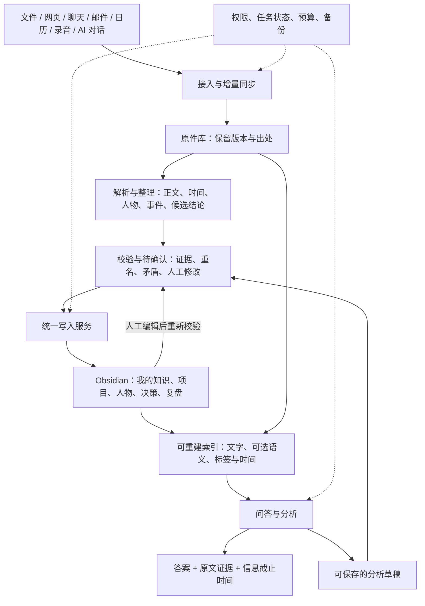

# 基于 Obsidian 的个人大脑：架构初稿 v0.1

日期：2026-09-22｜范围：本地完整克隆的五个参考项目｜交付性质：调研与设计，尚未开发或实机验证。

已确认的范围：**先覆盖全部来源，再分批接入。** 因此先建立完整来源清单与统一接入契约，第一批来源仅代表实施顺序，不缩小最终范围。

阶段约束：**第一阶段不接入 Ontology（本体），也不建设轻量本体、领域关系模型或独立知识图谱。** 保留普通笔记分类、标签、双链、来源引用与时间信息；这些只服务于整理和查证。本体能力放到后续按实际需求评估，不作为首阶段依赖或验收条件。

## 先读这一页

**建议建设一个“以 Obsidian 为知识中心、AI 为整理员、本地服务为后台”的个人大脑。** 你把资料交给它，它持续整理人物、项目、经历、观点和决策；你需要时，用一句话找到答案，并能点回原文。

把它想成一个私人图书馆：原始文件是藏书，Obsidian 是整理好的知识卡片，AI 是读书和整理的助理，后台服务负责收件、登记、更新和备份。

日常只需要三件事：**收资料、问问题、确认少量重要变化。** 后台的数据库、模型、队列不应成为你的日常操作步骤。

**开发方式：五个参考项目仅用于借鉴设计、流程和关键实现，自主开发本项目。它们不作为现在或后期要安装、集成、调用的产品组件，也不列入运行依赖。**

五个项目的借鉴重点：

| 参考项目 | 借鉴什么 | 在本方案中的位置 |
|---|---|---|
| Karpathy LLM Wiki | 原始资料、知识 Wiki、整理规则分开；知识持续积累 | 总体方法 |
| claude-obsidian | 有来源的笔记、主张账本、冲突检查、可恢复写入 | 知识整理和 Vault 写入的主要参考 |
| GBrain | 长期记忆、时间变化、混合检索、多来源处理 | 自研记忆与检索模块的设计参考 |
| Cognee | 实体、关系和图检索 | 资料加工流程参考；本体相关设计仅保留为后续研究资料 |
| llm_wiki | 导入队列、来源管理、审核、问答交互 | 产品体验和资料处理流程参考 |

**第一版建议：Obsidian + 一个本地中枢服务 + 可更换的 AI 模型。** 中枢及其知识管理能力由本项目自主开发，五个参考项目均不作为运行依赖。先通过少量真实资料证明“能记住、能找回、能更正、能忘记”，再扩大来源和分析能力。

本稿在现有[架构建议](./personal-brain-architecture.md)基础上，面向这五个完整仓库收敛范围。项目细节及固定版本证据见[Wiki 类项目复核](./obsidian-five-projects-wiki-evidence.md)和[记忆引擎复核](./obsidian-five-projects-engine-evidence.md)。以下写“建议”的部分属于我们的设计，不代表上游已经实现。

## 1. 它最终应该帮你完成什么

### 1.1 从“存了很多”变成“随时能用”

| 你的问题 | 大脑应交付的结果 |
|---|---|
| 我之前研究过这个问题吗？ | 找到当时的资料、结论，以及后来新增的证据 |
| 这个项目现在到哪一步了？ | 汇总文件、邮件、会议和对话，列出进展、阻塞和待确认事项 |
| 为什么当时做了这个决定？ | 给出当时掌握的信息、备选方案、决定及原始依据 |
| 我跟这个人聊过什么、答应过什么？ | 按时间整理相关对话与承诺，区分已完成和待核实 |
| 最近哪些信息改变了我的看法？ | 比较新旧证据，指出变化，不替你声称已经改变观点 |
| 这周有哪些值得注意的联系？ | 提出跨项目或跨主题的发现，明确标注 AI 推测 |
| 这条记忆不对，改掉／忘掉 | 显示影响范围，更新相关页面和检索结果，并报告处理状态 |

### 1.2 “所有个人来源”的准确含义

目标是给你愿意纳入的全部信息类型提供统一入口，不预设某个平台、文件类型或生活领域永远在系统之外。

但“已覆盖”必须分开说明：**拿到了哪些原件、哪些能被搜索、哪些已经形成知识、哪些保持更新。** 一个聊天导出文件已保存，不代表所有附件都解析成功；邮件同步了最近一个月，也不代表全历史已导入。

你明确表达的目标、价值观、偏好和决定可以进入“关于我”；AI 根据行为作出的推测只能进入“待确认观察”。第三方转述和 AI 对话里的建议，不能自动算作你的经历或观点。

## 2. 总体架构



Obsidian 采用本地 Markdown 文件，允许其他工具修改文件，并自动反映外部变更，适合做长期可读的知识载体。[官方存储说明](https://help.obsidian.md/Files+and+folders/How+Obsidian+stores+data)

### 2.1 六个模块，职责清楚

| 模块 | 负责什么 | 不应承担什么 |
|---|---|---|
| 接入器 | 拉取或接收资料，记录来源身份、版本、同步范围 | 擅自把摘要当成原件 |
| 原件库 | 保存资料快照、附件、校验值和来源清单 | 被 AI 改写以配合结论 |
| 知识整理器 | 提取候选事实、关联已有知识、生成修改草稿 | 直接绕过校验覆盖笔记 |
| 写入协调器 | 检查证据、版本与权限，应用变更，处理恢复 | 把模型输出视作天然正确 |
| 检索分析器 | 在指定范围内找知识与原文，形成可核对答案 | 把无法找到答案包装成确定结论 |
| Obsidian 入口 | 浏览、修改、提问、看进度与处理待确认 | 承担只能在窗口打开时才运行的全部后台任务 |

**初期这些模块属于同一个本地服务，而不是六个独立服务器。** 划清职责是为了以后替换解析器、模型或检索引擎时，不必重建整个大脑。

### 2.2 推荐运行方式

- 一台主电脑作为后台处理主机；Obsidian 关闭时，已启动的本地服务仍可继续处理。
- 主机离线时暂停抓取和加工；恢复后从进度点继续，不承诺断电期间仍实时更新。
- 第一阶段用 Obsidian 普通笔记和现有 AI 工具验证闭环；进入日常使用阶段，再做一个薄插件，提供“收资料、问大脑、看进度、待确认”面板。
- 手机先承担阅读和收集。跨设备同步知识文件；原件访问单独设计，不能让桌面的绝对文件路径变成手机上的死链接。
- 若未来确需全天候运行，再将后台迁往自有常开设备。第一版不增加公网服务、账号系统和多人协作。

## 3. 来源怎么全部汇集

以下是目标接入清单，并非五个项目已经提供这些可用连接器，也不表示你的账户已授权。

| 来源 | 初期入口 | 后续持续接入 | 容易遗漏的内容 |
|---|---|---|---|
| 现有 Obsidian、日记、随手记 | 选定目录导入，保留原目录 | 文件变化检测 | 人工笔记不能被当作机器草稿覆盖 |
| PDF、Word、表格、电子书 | 本地文件或文件夹 | 目录扫描与监听 | 扫描件、表格结构、页码和批注 |
| 网页、公众号、收藏、RSS | 网页剪藏、可取得的正文或导出 | RSS、书签增量、允许访问的网页更新 | 收藏网址不等于保存正文；无法访问要标明 |
| 微信、QQ、其他即时聊天 | 用户能导出的记录和附件 | 有受支持接口时再逐项接入 | 说话人、群身份、时间、撤回和缺失附件 |
| 邮件 | 导出或授权接口 | 增量邮件同步 | 会话线程、附件、转发、删除和历史范围 |
| 日历、待办 | 导出或授权接口 | 事件和完成状态同步 | 周期事件、时区、取消、改期 |
| 云盘、Notion、飞书等 | 文件／空间导出 | 各平台 API 或现有可靠连接器 | 文档更新、分享权限、嵌入文件 |
| 会议录音、语音备忘、视频 | 拖入原件 | 选定文件夹监听 | 转写错误、说话人、时间戳、长文件成本 |
| ChatGPT、Claude、Codex 等 AI 对话 | 可用的对话导出或本地日志 | 经验证的增量适配器 | 用户观点、模型建议和实际执行结果要分开 |
| 代码、项目资料、研究记录 | 选定仓库和文档目录 | 提交／版本变化 | 不扫描依赖、构建产物和密钥文件；代码文本不等于运行结果 |
| 图片、手写稿、截图 | 文件导入 + OCR／视觉描述 | 相册或目录的选定范围 | 识别错误；图片描述不能替代图片证据 |
| 健康、财务、证件、家庭记录 | 指定受限目录 | 后续逐项决定 | 默认限本地处理或只归档，单独控制模型外发 |

网页入口优先复用 Obsidian 官方 Web Clipper 的剪藏能力。它能把网页内容保存到 Vault，但不会替代邮件、聊天和云盘接入器。[官方 Web Clipper](https://help.obsidian.md/web-clipper)

### 3.1 一个统一的“收件格式”

所有接入器都交付同一类记录：来源平台、账户／空间、原始对象 ID、版本、原始时间、采集时间、原件位置、权限级别和解析状态。

以“账户 + 平台对象 ID”识别同一来源，以内容校验值识别同一版本。转发同一文章可能共用内容，但仍保留各自收到的时间和场景；相似表达不能仅凭相似度就合并成同一事实。

增量接入必须保留游标；先保存原件和任务，再推进游标。失败可以重试；遇到永久失败进入可见的失败清单，不让一份坏文件阻塞所有后续资料。定期补扫用于发现监听遗漏。

来源清单是长期维护的“覆盖地图”：每项记录平台／账户、资料类型、历史起止范围、预计量、可用接入方式、最近成功时间、四项覆盖状态、缺失原因和下一步。尚不知道你是否使用的平台标记“待盘点”，不能假定没有。新增来源只增加适配器，不另建一套知识库。MCP 可以提供查询或获取工具，但不会自动补齐后台调度、历史分页和同步游标。

### 3.2 首次全量历史与日常新增分开

建议分三轮：先建立全部资料目录和可搜索正文；再优先精读当前项目、最近资料及你标记的重要资料；最后逐步补齐旧档案。

所有允许纳入的资料都有记录，但不是每条“好的、收到”都生成一篇知识笔记。这样既能覆盖历史，又不会让 Wiki 被低价值页面淹没。没有精读的资料仍可在问答时按需检索，页面显示处理范围。

## 4. 原件、知识、索引，谁说了算

**原件证明“某个来源当时写了什么”；知识笔记记录“目前如何理解”；索引只负责“快速找到”。** 原件也可能有错误，保留原件不等于认可其内容。

| 数据 | 权威位置 | 恢复方式 |
|---|---|---|
| 原始文件、邮件／聊天快照、音视频 | `source-store/`，版本化原件 | 必须备份；不能依赖原网站长期存在 |
| 来源清单、原件版本、定位信息 | `source-store/manifests/` | 必须备份；仅有二进制文件不足以恢复上下文 |
| 人物、项目、概念、决定、人工修正、已接纳主张 | Vault Markdown 与账本文件 | 必须备份；保持可读、可导出 |
| 主张证据关系、依赖清单 | `vault/90-System/ledgers/` | 必须备份；用于更正和撤回传播 |
| 笔记模板、引用格式和整理规则 | `rules/` | 与数据版本一起备份；首阶段不包含本体定义 |
| 文字、向量、关系搜索索引 | 派生索引库 | 可从有效原件、知识和账本重建 |
| 连接器游标、任务、事务日志、撤回／排除清单 | `runtime/state.db` | 必须备份；尤其不能丢失“不要再次导入”的决定 |
| 账户令牌与密钥 | 系统钥匙串等独立凭据存储 | 重新授权或采用独立安全恢复机制 |

这张表是本方案的目标契约。参考案例中，**GBrain 的 Markdown 恢复能力只覆盖文件中保存的知识；DB-only 数据、撤回记录等仍需数据库备份。** 借鉴这一边界，我们自研时必须明确区分可重建索引与必须备份的状态，不能宣称“所有数据库都可以删了重建”。[GBrain 存储契约](../../references/gbrain/docs/architecture/system-of-record.md)

### 4.1 推荐的目录

```text
personal-brain-data/                 # 用户数据目录，与程序源码分开
  vault/                            # Obsidian 打开这里
    首页.md
    00-Inbox/                       # 收件箱及处理进度
    10-Sources/                     # 来源卡片、摘录、原件入口
    20-Me/                          # 我确认的目标、偏好、原则
    21-People/                      # 人物与交往记录
    22-Projects/                    # 项目与进展
    23-Areas/                       # 工作、学习、家庭等长期领域
    24-Knowledge/                   # 主题与概念
    25-Events/                      # 事件和时间线
    26-Decisions/                   # 决定、当时依据、后续结果
    30-Synthesis/                   # 跨来源分析和研究
    40-Reviews/                     # 日／周回顾和待确认
    50-My-Notes/                    # 你自由书写的正文
    90-System/                     # 规则、来源和主张账本、处理记录
    attachments/                   # 日常阅读需要的小附件
  source-store/                     # 大原件、版本、附件与清单
  rules/                            # 笔记模板、引用格式、整理规则；不含本体
  runtime/                          # 状态库、索引、队列；不当作笔记同步
```

这是新建库的建议。已有 Vault 采用映射接入，不强迫你重排旧目录。大视频不默认复制进 Vault；来源卡片用稳定的 `source_id`，由本地服务／插件解析到当前设备的原件位置。还没有插件时，以可读来源卡片和本机文件链接过渡，明确手机原件访问尚不可用。

## 5. 怎么让大脑真正理解你

### 5.1 先按笔记组织，不建立本体

第一阶段按需要整理人物、项目、主题、事件、决定及“关于我”等普通笔记，不要求预先定义完整对象类型。笔记和来源有稳定 ID，显示名称可以修改；文件夹、标签与双链用于导航。

“主张”就是一条可核对的说法，例如“项目 A 的交付日期是 10 月 15 日”。它必须能说明谁说的、何时说的、从何时有效、依据在哪，以及目前有没有争议。

人物参与什么项目、某次决定依据什么资料，先用自然语言与双链表达，不抽取成受控关系表，也不建设实体对齐或本体推理流程。重名不自动合并；日期相近也不能直接推断因果。

Obsidian 原生图谱显示笔记之间的链接，第一阶段可以直接使用，无需额外维护结构化知识图谱。后续只有实际问题证明普通笔记与检索不足时，才评估是否引入本体。[官方 Graph view](https://help.obsidian.md/plugins/graph)

### 5.2 四种内容必须分清

| 内容 | 示例 | 展示与处理 |
|---|---|---|
| 原始说法 | 邮件写着“预计下周完成” | 记录说话者和原文，不直接标成已完成 |
| 有依据的知识 | 两份资料一致指出当前负责人 | 附证据；有时效，不保证永远正确 |
| 你的确认 | 你明确说“这才是正确日期” | 作为人工修正保留；第三方原文继续存在 |
| AI 推断 | “延期可能与供应变化有关” | 明确标为推断，不能自动晋升成事实 |

事实冲突不靠简单投票：十篇转载同一篇文章不等于十个独立证据。来源是否独立、是否直接参与、是否更新、更正是否明确，都需要记录。

### 5.3 知识积累的具体例子

假设会议纪要说“项目 A，10 月 1 日交付”；一周后的邮件说“改为 10 月 15 日”；你的日记说“延期让我重新考虑方案”。

系统应生成项目页、两条有时间的日期主张、一条变更事件，以及与你的反思相连的笔记。问“现在什么时候交付”，回答 10 月 15 日并引用邮件；问“原计划呢”，回答 10 月 1 日并引用会议纪要。不能让新信息把历史擦掉，也不能把你的担忧自动当成项目已经失败。

第一阶段的重要说法可保存在笔记正文并附引用，不要求每条说法单独建页或转换成三元组。需要追踪更正时，使用普通记录和来源编号。以下为演示字段，不是现有实现：

```yaml
---
id: claim-demo-002
note_kind: sourced_statement
related_note: "[[项目 A]]"
statement: "项目 A 的交付日期调整为 2026 年 10 月 15 日。"
valid_from: 2026-09-22
recorded_at: 2026-09-22T20:00:00+08:00
source_ids:
  - source-demo-mail-002
status: accepted
assertion_kind: source_statement
supersedes: claim-demo-001
privacy: personal
---
```

主张的多条证据记录在账本：`source_id + source_version + locator + quote_hash + relation`。定位可以是 PDF 页码、邮件 Message-ID、聊天消息 ID 或音频起止秒；只有找到真实位置才能引用。扁平属性适合 Obsidian，复杂证据不塞进嵌套 YAML。[官方 Properties](https://help.obsidian.md/properties)

## 6. AI 如何持续整理，而不把知识越写越乱

### 6.1 一份新资料的处理过程

1. **收件：**登记来源、保存原件、核对是否重复，立即显示“已收到”。
2. **解析：**提取正文和定位；扫描件走 OCR，音频走转写。失败则保留原件并说明原因。
3. **理解：**识别人、项目、时间和候选主张，查找已有笔记及可能矛盾。
4. **生成草稿：**提出要新建／更新的页面和证据，不直接发布模型原话。
5. **校验：**检查来源能否打开、引用是否支持结论、对象是否重名、是否覆盖人工内容。
6. **发布：**低风险的新增来源卡片、摘要可自动进入知识库；身份合并、重要事实替换及个人画像变化进入待确认。
7. **追踪：**登记修改影响了哪些页面，更新索引和首页处理状态。

“资料已整理”与“含待确认主张”可以同时成立，不能因为一项争议就阻塞整份资料。审核只集中展示你需要判断的几件事，不要求逐页点击批准。

### 6.2 人和 AI 都能修改，但有明确边界

- `50-My-Notes/` 的正文由你控制；AI 可以建议、引用，不能直接重写。
- 系统整理页区分“自动整理”与“我的补充”。你直接改动自动部分时，也保留改动，下一次 AI 更新要检查版本差异。
- AI 准备变更时记录目标文件校验值；发布前再比一次。文件已变化，就重新合并或进入待确认，不能强行覆盖。
- 一个知识变更包可以涉及多个文件；通过预写日志、临时文件和恢复记录协调发布。普通文件系统的多文件变更不能假装天然原子化。
- 文件已经发布但索引尚未完成时，标记“索引更新中”；查询过滤旧版本结果，必要时直接读当前文件。
- 监听器区分自身写入与外部修改，防止“自动改动 → 再摄入 → 再改动”的循环。其他设备同步冲突先作为冲突处理。

这些原则重点借鉴 claude-obsidian 的事务和证据账本，以及 GBrain 的发布与恢复契约；由本项目实现对应机制，并通过自己的测试验证。[Wiki 证据](./obsidian-five-projects-wiki-evidence.md) · [引擎证据](./obsidian-five-projects-engine-evidence.md)

处理缓存同时记录原件版本、解析器版本、整理规则版本和模型／提示词版本。原文没变但规则改变时，能够选择性重新处理，避免长期沿用旧规则产物；升级前先在小样本上比较结果。

### 6.3 更正、删除和忘记必须影响后续回答

保存完整依赖链：**来源版本 → 主张 → 专题／项目总结 → 索引与回答缓存**。

原文更新时新增版本，找出受影响主张，重新检查总结。旧总结尚未更新时显示“资料已有变化”，不能当成最新结论直接返回。

| 操作 | 含义 | 系统行为 |
|---|---|---|
| 归档 | 暂时不用，但保留历史 | 普通视图隐藏，需要时可按历史范围搜索 |
| 纠正 | 原来的理解或记录不对 | 记录修正与依据，撤销旧结论的当前效力，重新整理依赖页面 |
| 忘记 | 不再让系统使用指定内容 | 先用撤回清单立即阻断检索，再清理主张、摘要、索引和缓存 |
| 删除原件 | 移除本地保留的源材料 | 区分仍有其他证据的主张与失去支撑的主张，报告尚存副本范围 |

来源端的删除或失联不直接等同于“我要求忘记”。接入器记录远端变化，按该来源的保留策略处理。用户的明确忘记请求优先；保留排除标识，防止下一次同步重新导入。

“原件不可改写”允许用户授权删除，并不意味着不能删除。备份、其他设备和已导出的副本有各自的清理范围；不能仅因搜索不到就报告彻底擦除。恢复备份时应先恢复并应用最新撤回清单，再允许查询。

## 7. 怎么提问和分析

### 7.1 同时查整理好的知识与原文

默认过程：识别问题范围 → 按权限和时间筛选 → 查知识页和原文 → 补充必要关联 → 验证引用 → 回答。

文字搜索擅长精确名称和编号，语义搜索擅长“记得大概意思”；按标签和日期筛选、沿笔记双链补充上下文，就能支持第一阶段的关联查找，不依赖本体或图查询。不能只查已生成的 Wiki，否则尚未精读的资料会被遗漏。

小规模先验证文字搜索、日期筛选和来源引用。SQLite 全文搜索的中文分词不能直接假定够用，要用中文问题实测，并保留子串／字符粒度补偿方案；语义索引通过可替换接口增加，单独测量中文收益。

每次重要回答包含：结论、关键证据、资料覆盖／截止时间，以及尚不确定的部分。遇到“目前进度”，如果邮件已一周没同步，要在答案里说明时效。

### 7.2 把一次问答变成长期收益

值得保存的分析可一键生成专题草稿，经过同一校验路径进入 Wiki。系统生成的回答不是新的独立证据：必须继续引用最初的资料，防止模型引用自己、越写越确信。

建议的日常分析：项目状态、决策复盘、专题知识、交往时间线、承诺清单、周回顾。自动分析只更新有新证据的部分；没有变化时不重复制造提醒。

## 8. Obsidian 中你实际看到什么

首页应有六个入口：**收资料、问大脑、我的项目、我的知识、待确认、最近变化**。

| 页面 | 展示内容 |
|---|---|
| 首页 | 最近加入的资料、活跃项目、少量需处理事项，以及来源同步状态 |
| 项目页 | 当前状态、时间线、相关人物、重要决定、证据和下一步建议 |
| 人物页 | 身份、关联项目、交往记录和承诺；不自动合并同名人 |
| 知识专题 | 核心结论、支持／反对资料、适用范围、最近更新时间 |
| 待确认 | “发现两种交付日期”“这两个名字是否同一个人”等具体问题 |
| 来源页 | 原件、摘录、采集时间、处理结果，以及影响了哪些知识 |

优先用 Obsidian 自带属性、链接、搜索和 Bases 做项目／资料列表；Bases 能基于本地 Markdown 属性提供表格等视图。复杂问答和处理进度再由薄插件提供。[官方 Bases](https://help.obsidian.md/bases)

图谱作为按人物、项目、主题展开的辅助视图。它应帮助追查关系与证据，而不是让你每天面对几万个点。

## 9. 五个项目的借鉴边界

下面是架构决策，不是性能排名。准确提交、许可证文件和源码定位放在两份复核报告。

| 项目 | 借鉴后自主实现什么 | 参考边界 |
|---|---|---|
| Karpathy LLM Wiki | 采用“原件—知识—规则”分层和 ingest/query/lint 闭环 | 这个目录是思路文档，不能当作可安装的完整产品或 Astro-Han 的同名实现 |
| claude-obsidian | 来源账本、版本冲突检查、可恢复写入与知识维护流程 | 不依赖其插件或 Python 核心作为产品底座 |
| GBrain | 自研来源管理、文字与语义检索、时间更新、更正和持久撤回机制 | 不安装其引擎，不建设调用 GBrain 的适配器 |
| Cognee | 借鉴资料分块、处理流水线、增量更新与来源定位 | 不集成其服务；本体相关能力不进入第一阶段 |
| llm_wiki | 自研导入队列、来源管理、待确认与原文问答体验 | 不嵌入其桌面应用；借鉴设计不等于直接复制代码 |

自研系统统一管理原件、已接纳知识和撤回记录，各模块遵守同一读写契约。开发任务按本项目的业务能力拆分，不按“接入某个参考项目”拆分。若具体实现涉及引用源代码，需另行检查代码许可证；当前架构不预设复制或 fork 任何项目。

源码还显示：Cognee 更完整的来源追踪和矛盾检测默认关闭；llm_wiki 的异步审核不阻止先写入，部分页面失败也可能继续处理后续页面。因此本方案的“关键变化发布前待确认”和“可恢复变更包”需要自主实现并验证，不能因为上游有审核／备份按钮就认定已经具备。

### 9.1 推荐技术骨架

| 部分 | v0.1 建议 | 升级条件 |
|---|---|---|
| 界面 | Obsidian 原生视图；稳定后加 TypeScript 薄插件 | 真实使用证明需要额外入口 |
| 中枢 | 一个本地 Python 服务，内部按模块划分 | 这是待验证的工程选择，依据自研任务与文档处理生态评估，不由参考项目的语言决定 |
| 运行状态 | SQLite，可靠任务表、事务日志、撤回清单 | 多主机并发才重新评估集中数据库 |
| 知识与规则 | Markdown + 来源／更正账本 + 笔记模板，不建设本体 | 不因新增检索引擎改变知识权威 |
| 检索 | 本地文字检索 + 标签／日期筛选；可选语义检索 | 用同一评测集验证自研检索策略的质量、耗时与成本 |
| 模型 | 统一的整理／问答接口，分别配置模型与预算 | 解析、视觉、转写按格式调用；不预定某一家模型 |
| 本体能力 | 第一阶段不开发 | 后续按实际需求评估自研范围，无强制引入时间点 |

检索、整理和写入模块通过本项目内部接口协作。具体基础库、模型 SDK 和运行框架在开发时按需求选择；这与把五个参考项目当成运行组件是两回事。框架选择不能先于知识读写契约。

## 10. 数据边界、运行成本与恢复

这些是实现“个人大脑”的必要设计，不是增加你的每日操作步骤。

**处理范围预先配置一次。** 来源分公开、个人、受限三级；受限资料默认不送外部模型。原文、OCR、转写、向量生成、问答和日志都遵守同一策略；摘要继承所用来源中最严格的级别。标签本身不是权限控制，检索过滤和文件访问必须实际执行限制。

本地保存资料不等于本地 AI 处理。云模型可能收到选中的文本片段；具体发送范围、模型和是否允许联网由来源策略决定。调用外部搜索时也不能把私人全文当搜索词发出去。

网页、邮件、笔记中的指令只是资料，不授予执行命令、读取密钥或外发文件的权限。整理任务默认只有读取该批资料和提出变更草稿的能力；只有协调器能发布知识文件。

**成本优先花在有价值的信息上。** 先解析、去重和缓存，再按变化调用模型；超长资料分批、旧资料后台处理；音视频转写和视觉分析单独显示预计处理量。每批记录耗时、模型用量、失败数和费用估算，允许暂停、限额和继续。未配置价格或无法计价时明确显示未知，不编造月费。

**备份要能一起恢复。** 定期保存原件、来源清单、Vault、规则和状态库的一致快照；索引可以重建。不要直接复制正在写入的数据库当作可靠备份。恢复演练需核对源文件、引用、待处理任务、撤回清单与人工修改，确认恢复后不会重新出现已忘记的信息。

## 11. 从初稿到可用系统的建设顺序

这里是验收顺序，不是未经估算的工期承诺。

**第一阶段范围为 M0–M2：盘点全部来源，分批跑通基础知识闭环并保证可维护。全程不包含本体、受控领域关系、实体对齐引擎或独立图数据库。** M3 以后扩大接入和分析，也不以接入本体为前提。

| 阶段 | 做到什么 | 必须现场证明 |
|---|---|---|
| M0：确定范围 | 来源清单、现有 Vault 结构、数据量、受限资料与预算 | 每个来源有“已接入／待接入／无法取得”状态，不能把未知当覆盖 |
| M1：最小闭环 | 本地文件、网页、AI 对话导出；原件、知识、带证据问答 | 导入→退出重启→找回→更正→忘记，完整走通 |
| M2：稳定维护 | 增量队列、版本冲突、人工修正、更新传播、备份 | 重复导入不重复；崩溃可恢复；AI 不覆盖人工编辑；删除后不再命中 |
| M3：多来源常用 | 按实际需求增加邮件、日历、聊天和会议接入 | 历史范围清楚；分页、断网、撤权、缺附件和远端更新都有结果 |
| M4：分析中枢 | 项目页、人物时间线、决策追踪、周复盘和 Obsidian 面板 | 用真实问题获得可用答案；资料不足时承认不知道 |
| M5：可选能力增强 | 按实际瓶颈优化自研检索和分析；如确需本体再单独设计 | 同一资料、同一问题下有明确收益才建设，不安排参考项目集成 |

M1 验证的是本项目自己的最小闭环。后续里程碑也以自主开发的能力和验收结果为交付，不设置参考项目安装、适配或集成任务。

### 11.1 建议用什么验收

准备 100–300 份经你允许的真实或脱敏资料，以及 30 个有预期答案的问题，包含中文、人名重名、日期变化、矛盾、图片／扫描件和无答案问题。数量是建议，不是已执行结果。

- 评估问答：找到相关资料了吗；结论对吗；引用真的支持结论吗；是否漏掉新信息；推断是否标明。
- 评估维护：重复处理不重复、任务中断能恢复、手工编辑保留、撤回后旧内容不再用于回答。
- 评估覆盖：每个来源的历史范围、已解析数量、失败数量、最后同步时间、待精读数量。
- 评估代价：每百份资料的耗时和费用、提问等待时间、人工审核负担、备份恢复时间。

撤回、越权访问、人工修改保护、恢复这些关键用例必须全部通过。问答质量阈值应在基线测量后确定，不能以“模型有回复”或“页面打开了”代替验收。

## 12. 本轮结论和待收敛事项

架构方向已经可以确定：**第一阶段不接入本体；知识长期放在你能读懂的文件里；原件和证据保留；后台只保留一个发布入口；检索引擎可更换；从第一版就支持更新、更正和忘记。**

具体开发前还需盘点三件事：全部实际来源、账户和大致数量，并据此安排接入批次；是否已有正式 Obsidian Vault；哪些资料可交给云模型以及可接受的处理预算。当前按单人、本地主机、已有资料不搬动、全部来源纳入规划后分批接入设计。

本轮已完成的交付是五项目静态调研和架构初稿。没有安装这五套系统，没有接入个人账户，没有导入你的资料，没有运行真实模型或 Obsidian 浏览器／客户端验收。本文的流程图和示例均为设计，不代表已有可运行产品。
