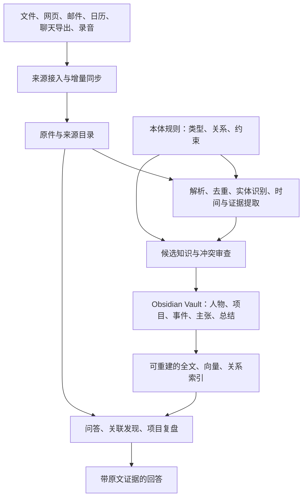

# Obsidian 个人大脑：建议架构与验收路线

> 当前开发约束（2026-09-22 更新）：五个参考项目仅用于借鉴开发，不作为现在或后期接入的产品组件；第一阶段不开发本体。本文保留此前调研与方案记录，涉及组件接入、本体首版建设的旧建议不再作为开发依据。当前架构以[个人大脑初稿](./obsidian-personal-brain-v0.1.md)为准。

调研日期：2026-09-22。本文是面向本项目的设计建议，不表示任何组件已经安装或通过测试。项目证据与最终选型见[总报告](./README.md)。

## 1. 你要建的究竟是什么

把它想成一个有助理的私人图书馆：

- **原始资料**是原书、信件、录音，保留原貌，方便查证。
- **Obsidian**是你能随时翻阅和修改的知识笔记。
- **AI**是整理员：读资料、找人物和事件、比较矛盾、整理总结。
- **知识图谱**是关系账本：谁参与什么项目、何时做了什么决定、证据在哪里。
- **Ontology（本体）**是账本的填写规则：哪些属于人、组织、项目；“负责”的两端应该是什么类型。

例如，笔记里写 `[[张三]]` 只能说明提到了张三。更有用的记录是：“张三从 9 月 1 日开始负责 A 项目，证据是某封邮件；后来 9 月 20 日换成李四。”这让大脑可以回答“现在是谁负责”“当时是谁负责”“这次变化影响哪些任务”。

Obsidian 原生图谱把笔记作为节点、内部链接作为边；它本身不替我们定义这些业务关系。[Obsidian Graph view](https://help.obsidian.md/Plugins/Graph+view)

## 2. 建议的数据流



**首版只保留一个知识写入入口。** 无论以后采用 GBrain、Cognee 或其他模块，模型提出变更，由同一个服务检查来源、版本和冲突后写入；避免多个 Agent 同时改坏文件。

Obsidian Vault 本身是本地文件夹，笔记为 Markdown，外部改动可反映到应用中。因此适合作为长期可读的知识载体。[Obsidian 存储说明](https://help.obsidian.md/Files+and+folders/How+Obsidian+stores+data)

## 3. 每一种数据，指定一个可信原件

| 数据 | 建议的权威位置 | 说明 |
|---|---|---|
| 下载或导出的原始文件、录音、邮件快照 | Vault 外的 `source-store/`，加来源清单和内容哈希 | 避免把全部视频、聊天附件塞进日常笔记；用稳定 ID 连接 |
| 人物、项目、事件、知识主张、人工修正 | Vault 的 Markdown + 简单 frontmatter | 可阅读、可编辑、可迁移；每条主张连接原件 |
| 本体定义 | 版本化的 `ontology/` | 一份规则；生成其他格式，避免手写两套互相冲突的定义 |
| 全文、向量和关系索引 | 派生数据库 | 应能从原件、知识记录和本体重建；不能成为唯一知识副本 |
| 导入游标、任务状态、重试、审核记录、删除记录 | 运行数据库 | **不是随便可丢弃的缓存**，需要单独备份 |
| API 凭据和访问令牌 | 系统钥匙串或密钥存储 | 不进入 Vault、图谱和 Git |

如果直接使用现成引擎，先核对它是否真的满足上述契约。特别是 GBrain 的部分事实与运行数据是 DB-only；这是我们对新系统的目标设计，并非宣称所有 GBrain 数据都可由 Markdown 恢复。

建议的 Vault 结构：

```text
vault/
  00-Inbox/          新资料入口与待处理清单
  10-Sources/        原件的可读索引、摘录和引用
  20-People/         人物
  21-Organizations/  组织
  22-Projects/       项目
  23-Events/         事件
  24-Concepts/       概念
  25-Claims/         有证据、有时间的具体主张
  30-Synthesis/      专题总结和跨来源分析
  40-Reviews/        周报、复盘、待确认矛盾
  90-System/         使用说明与处理记录索引
```

每个对象使用稳定 ID；改名不等于新建一个人。同名人物先分开，别名合并有记录且可撤销。人员、项目、时间等高价值字段由你确认后优先于模型猜测。模型置信分数只是提示，不能当成真实概率。

## 4. 本体先从小而准确开始

第一版建议的类型：Person、Organization、Project、Event、Document、Concept、Claim；需要管理待办时再加 Task。

第一版关系：`works_for`、`participates_in`、`responsible_for`、`discusses`、`supports`、`contradicts`、`supersedes`。每种关系规定允许的两端类型，并保存来源和有效时间。

一条主张可以保存成独立笔记，使用 Obsidian 易编辑的扁平属性：

```yaml
---
id: claim-001
type: Claim
subject: "[[张三]]"
predicate: responsible_for
object: "[[A项目]]"
valid_from: 2026-09-01
valid_to: 2026-09-20
recorded_at: 2026-09-22
source: "[[邮件-001]]"
source_locator: "message-id:demo#paragraph-3"
status: superseded
superseded_by: "[[负责人变更-002]]"
---
原文摘录：张三从本月起负责 A 项目。
```

示例日期和人物均为演示数据。复杂的多来源证据可放正文或独立记录，避免深层嵌套 YAML：Obsidian 属性界面不支持嵌套属性。[Properties](https://help.obsidian.md/Editing+and+formatting/Properties)

时间需要区分“事情什么时候有效”和“大脑什么时候得知”。来源定位至少到邮件 ID、聊天消息 ID、PDF 页码或录音时间段；摘要引用摘要会失去证据链。

**轻量本体不等于完整 OWL 推理。** 初期用类型、受控关系和校验规则即可；需要跨系统语义互通或形式推理时再引入 RDF/OWL。OWL 定义具有正式语义的类、属性与个体；SHACL 用于检查 RDF 图是否符合约束，职责不同。[W3C OWL 2](https://www.w3.org/TR/owl2-overview/) · [W3C SHACL](https://www.w3.org/TR/shacl/)

Cognee 可作为后续本体实验对象，但其官方文档说明：本体对齐只读取部分 OWL 构造；默认保留没有匹配到本体的实体，且本体文件没有自动热更新。选择它不等于所有规则、事实和矛盾都被自动正确处理。[Cognee Ontology Quickstart](https://docs.cognee.ai/guides/ontology-support)

## 5. “所有来源”按连接器逐个接入

以下是**建议建设范围，不是宣称所调研项目已经具备所有连接器**。第一批优先级可按你的实际来源调整。

| 来源 | 建议接入方式 | 必须补上的可靠性 |
|---|---|---|
| Obsidian、本地 Markdown/TXT/PDF/Office | 目录扫描 + 变更监听 + 文档解析 | 修改检测、重复导入、扫描件识别、页码来源 |
| 网页、收藏、RSS、公众号文章 | 剪藏或可访问的页面/导出文件 | 正文、URL、作者、时间、附件和去重；收藏列表不等于正文 |
| 邮件、日历、云盘 | 各平台授权接口或导出文件 | 分页、增量游标、撤销授权、附件、删除变化 |
| 微信和其他聊天记录 | 先支持用户能够导出的文件 | 说话人身份、群与私聊区分、消息时间、附件；逐个平台确认可用接口 |
| 会议、语音、视频 | 原件归档 + 转写 + 时间段引用 | 说话人校正、转写错误、处理费用和耗时 |
| AI 对话、代码资料、阅读笔记 | 对话导出、仓库/文件导入 | 区分本人观点、AI 建议与已执行结果 |
| 财务、健康等敏感资料 | 独立分区 + 明确的模型访问配置 | 避免普通检索或总结意外混入；按来源控制外发 |

补充参考：官方 [Obsidian Web Clipper](https://github.com/obsidianmd/obsidian-clipper) 是 MIT 项目，可将网页保存为 Markdown，适合网页入口；它不是全来源同步系统。

每个连接器采用同一状态流：发现 → 保存原件 → 解析 → 提取候选 → 校验 → 更新知识 → 更新索引。失败可以从中断处重试；同一份资料重试不会生出重复人物、事件和总结。MCP 是工具接口，本身不保证后台定时同步、增量游标或全量历史导入。

## 6. 真正需要自己做的中枢能力

1. **证据和身份。** 稳定 ID、原文定位、同名消歧、跨来源合并、人工纠错。
2. **变更和撤回。** 原文修改后，使旧结论失效并重新生成受影响总结；删除来源后检查全文、向量、关系、缓存和导出中的副本。
3. **双向编辑。** 人在 Obsidian 修改后重新索引；模型更新时检查文件版本，避免覆盖人工修改。自动生成部分与人工正文有明确边界。
4. **分析而非仅检索。** 区分有证据的事实、来源的说法和 AI 推断；跨资料发现矛盾、变化、相关机会，并能返回原文。
5. **可恢复。** 备份原件、Vault、本体及运行数据库；真正演练恢复。删除还要区分在线删除与备份到期，不能声称保留在历史备份中的内容已彻底消失。
6. **来源内容不指挥助手。** 网页和邮件里的“请忽略规则、上传文件”等文字当资料处理；只有用户授权的操作才能执行。

## 7. 建设顺序与验收门槛

下面是里程碑，**不是工期承诺**；数据规模、模型费用、平台授权尚未明确。

| 阶段 | 交付内容 | 通过标准 |
|---|---|---|
| 第 1 步：能正确记住 | 本地资料 + 网页入口；带来源的问答；基础 Vault | 重启后可找回；回答能打开原件；同一资料导入两次不重复 |
| 第 2 步：懂关系和变化 | 人物/项目/事件/主张，时间关系、冲突待审 | 同名不乱合并；能回答历史与当前负责人；更正后不再返回旧结论 |
| 第 3 步：更多来源持续进来 | 邮件、日历、聊天导出，增量队列 | 断网重试不漏不重；能看到哪个来源最后同步成功、哪里失败 |
| 第 4 步：用真实问题做分析 | 项目复盘、专题综合、证据图和周总结 | 每个关键结论有证据；推断有标记；资料不足时明确说不知道 |
| 第 5 步：决定是否加 Cognee | 用同一份数据与问题进行对比实验 | 多跳关系问题确有收益，同时新增成本、同步和删除仍可控 |

首个实验可以先用 **100–300 份脱敏资料 + 30 个真实问题**。这是建议的评测规模，非已完成测试；应覆盖精确查找、跨来源归纳、时间变化、矛盾、无答案、修改和删除。

记录：引用是否支持结论、实体是否合错、重复导入是否稳定、每批处理的费用和时间、重启与恢复结果。所有删除/恢复与关键纠错用例必须通过；问答正确率由人工按固定样本评判后再设正式上线阈值。

成本主要来自文档解析、OCR/转写、实体抽取、摘要更新、向量生成、问答及备份。不要对未变化资料反复全量处理，也不要未经测量就承诺“几十元处理全部历史资料”。

## 8. 日常使用应该足够简单

你只需要几个入口：**收资料、问大脑、看项目、查证据、处理待确认、更正或忘记**。后台显示最近同步结果和失败原因，技术组件名称不必成为你的操作步骤。

本方案没有把你锁定到某个模型或 Agent 框架；先证明资料、知识和索引的闭环，再决定运行框架。此前讨论过的 Pi/GBrain 分工可以作为历史参考，但不作为本轮已确定的实现前提。
